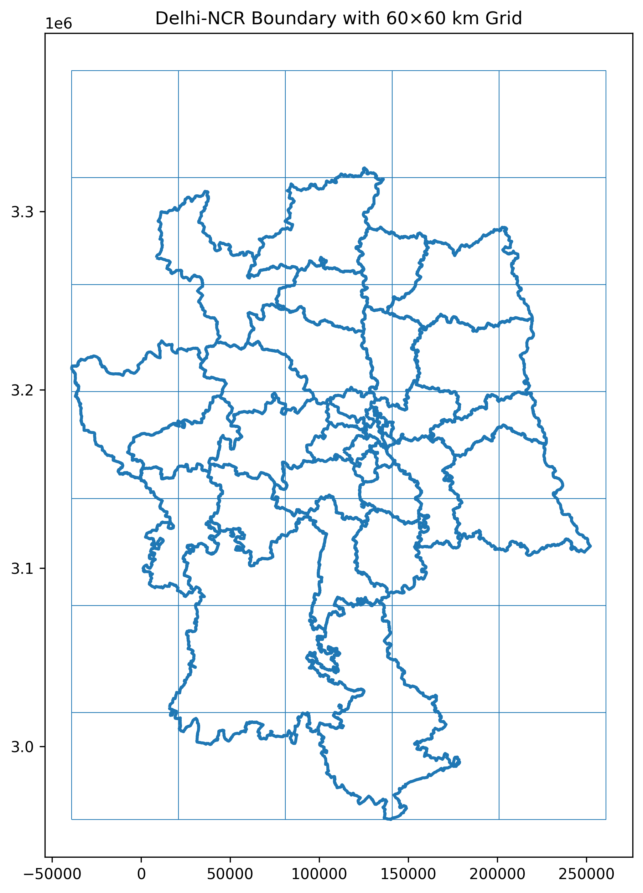
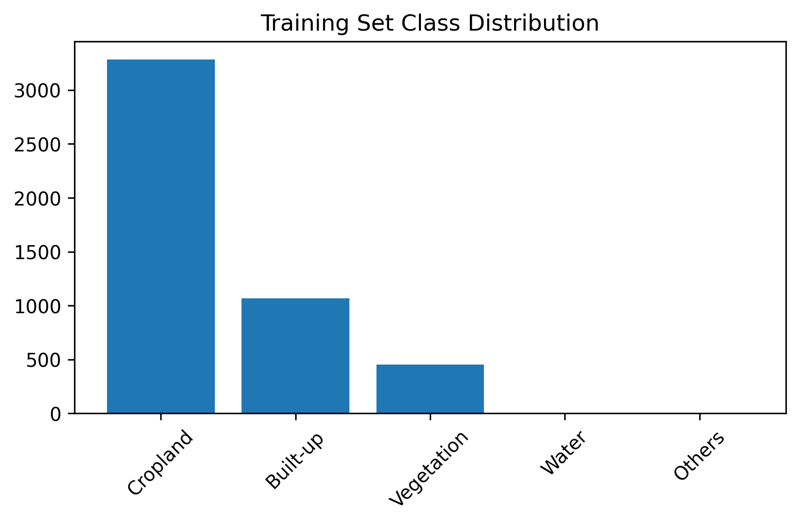
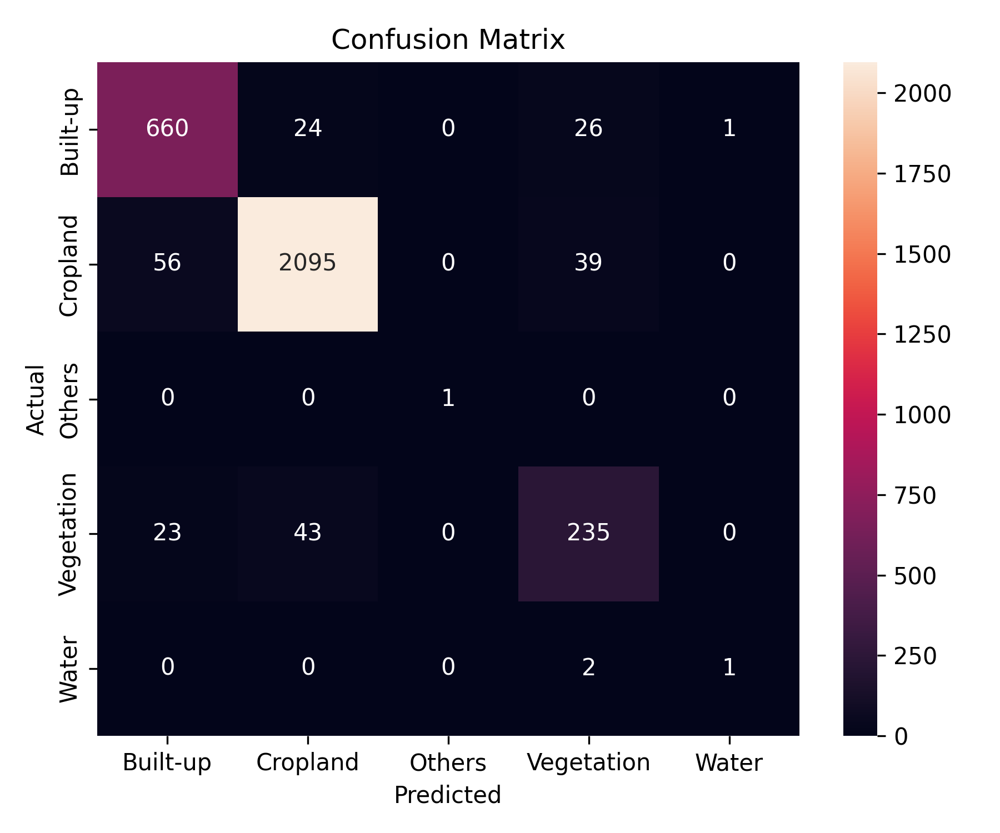

# AI-for-Sustainability
This project implements a complete geospatial machine learning pipeline for land-use classification in the Delhi-NCR region. The workflow includes spatial filtering of satellite image patches, raster-based label construction using ESA WorldCover data, and supervised classification using a pretrained ResNet18 model.
---
## Q1 – Spatial Reasoning & Data Filtering

- Delhi-NCR boundary reprojected to EPSG:32644
- 60×60 km grid generated
- Satellite image patches were filtered based on whether their center coordinates fall inside the NCR boundary.

**Results:**
- Total images before filtering: 9216
- Images inside NCR: 8015

Grid overlay visualization:

---

## Q2 – Label Construction & Dataset Preparation

- ESA WorldCover 2021 raster was used for label extraction.
- For each filtered image, a 128 × 128 raster patch centered at the image coordinates was extracted.
- The dominant (mode) land-cover class within the patch was assigned as the label.
- ESA land-cover codes were mapped to five simplified classes:

  - Built-up  
  - Cropland  
  - Vegetation  
  - Water  
  - Others  

- A stratified 60/40 train-test split was performed.

Class distribution:

---

## Q3 – CNN Model Training & Evaluation

- Model: Pretrained ResNet18  
- Loss Function: Class-weighted CrossEntropyLoss (to address class imbalance)  
- Optimizer: Adam  
- Input size: 128 × 128 RGB

### Final Performance

| Metric | Value |
|--------|--------|
| Test Accuracy | 0.9267 |
| Macro F1 Score | 0.8387 |

### Confusion Matrix

---

## Observations

The dataset exhibited significant class imbalance, particularly for Water and Others categories. Using class-weighted loss improved minority class recall and substantially increased the Macro F1-score compared to an unweighted baseline.
This demonstrates the importance of handling imbalance in geospatial land-use classification tasks.
---

## Tools used and Acknowledgement

This assignment was implemented independently using the Kaggle environment, as the dataset was hosted there. Minor assistance was taken for debugging and structural refinement during development. All implementation details and concepts are fully understood and can be explained if required.
---
